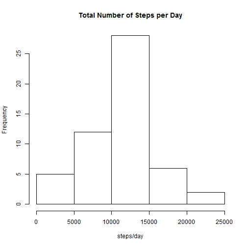
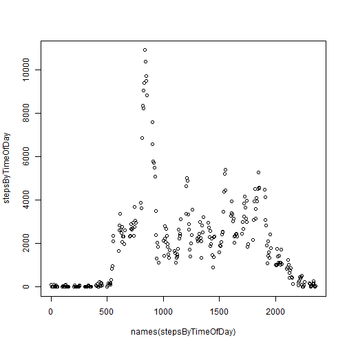

# Assignment 1
========================================================

Loading data:


```r
activity <- read.csv("D:/Projects/GitHub/ReproducibleResearch/activity.csv")
```


## Mean total number of steps taken per day


```r
activityCleaned <- activity[complete.cases(activity), ]
stepsByDay <- tapply(X = activity$steps, INDEX = activity$date, FUN = sum)
totalNumberOfStepsPerDay <- stepsByDay[complete.cases(stepsByDay)]
```


Total number of steps taken per day:
126, 11352, 12116, 13294, 15420, 11015, 12811, 9900, 10304, 17382, 12426, 15098, 10139, 15084, 13452, 10056, 11829, 10395, 8821, 13460, 8918, 8355, 2492, 6778, 10119, 11458, 5018, 9819, 15414, 10600, 10571, 10439, 8334, 12883, 3219, 12608, 10765, 7336, 41, 5441, 14339, 15110, 8841, 4472, 12787, 20427, 21194, 14478, 11834, 11162, 13646, 10183, 7047


```r
hist(totalNumberOfStepsPerDay, main = "Total Number of Steps per Day", xlab = "steps/day")
```

 


        | value
--------|--------------------------------------
Mean    |1.0766 &times; 10<sup>4</sup>
Median  |10765


```r
stepsByTimeOfDay <- tapply(X = activityCleaned$steps, INDEX = activityCleaned$interval, 
    FUN = sum)
plot(names(stepsByTimeOfDay), y = stepsByTimeOfDay)
```

 


Time of highest activity: 835

Rows containing NA values: 2304


